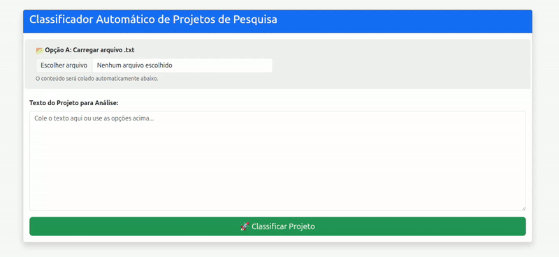

# Classificação Automática de Projetos de Pesquisa Acadêmicos



Este repositório contém o código-fonte do protótipo desenvolvido para a dissertação de mestrado "Uma Metodologia para Classificação Automática de Projetos de Pesquisa Acadêmicos com o uso de Aprendizado de Máquina e Processamento de Linguagem Natural". O sistema apresenta uma aplicação web interativa capaz de classificar automaticamente projetos acadêmicos especificamente nas linhas de pesquisa do Programa de Pós-Graduação em Artes (PPGArtes) da Universidade Federal de Minas Gerais (UFMG).

## 🧠 Treinamento dos Modelos e Metodologia

A construção deste classificador baseou-se em um rigoroso processo experimental com dados reais, avaliando o desempenho de diferentes técnicas de Processamento de Linguagem Natural (PLN) e Aprendizado de Máquina (AM).

### Base de Dados e Pré-processamento

- **Corpus Textual:** O modelo foi treinado com uma base de 573 projetos de pesquisa (referentes aos anos de 2016 a 2024), submetidos ao Programa de Pós-Graduação em Artes (PPGArtes) da Escola de Belas Artes da UFMG.
- **Extração de Texto:** Os projetos, originalmente em PDF, foram convertidos para texto puro utilizando a biblioteca **Docling** e **BeautifulSoup**.

### Ferramentas e Bibliotecas Utilizadas

- **Scikit-learn:** Utilizada para implementar os algoritmos tradicionais de classificação (SVM, Decision Tree, KNN, Naive Bayes e Random Forest), extração de características (Bag of Words e TF-IDF), e otimização via GridSearchCV.
- **Transformers (Hugging Face):** Utilizada para o carregamento do modelo pré-treinado e execução do ajuste fino (_fine-tuning_).

### Modelos Finalistas

Dois modelos consolidaram-se como o núcleo da aplicação web:

1. **Random Forest (Campeão entre os Tradicionais):** Utilizando vetorização Bag of Words (BOW) e normalização morfológica (_stemming_). Alcançou F1-Score Macro de 0.9101 na classificação de texto completo.
2. **BERT (Campeão Geral):** Baseado no _BERTimbau_ (`neuralmind/bert-base-portuguese-cased`). Alcançou F1-Score Macro de 0.9810 no conjunto de texto completo.

---

## 🖥️ Funcionalidades da Aplicação Web

A interface foi construída utilizando **FastAPI com Jinja2 Templates**, oferecendo as seguintes funcionalidades diretamente no navegador:

- **Classificação em Tempo Real:** Submissão de textos de projetos com inferência simultânea nos modelos Random Forest e BERT.
- **Comparativo de Desempenho:** Exibição lado a lado das linhas de pesquisa preditas e do tempo de inferência gasto por cada modelo.

---

## 🚀 Como executar o projeto localmente

Para garantir a reprodutibilidade, o projeto foi totalmente containerizado com Docker.

### 📦 Gestão dos Modelos

Devido às restrições de tamanho do GitHub, os arquivos pesados dos modelos treinados encontram-se hospedados nas **GitHub Releases** deste repositório e são **baixados automaticamente** durante o _build_ da imagem Docker.

### Pré-requisitos

Certifique-se de ter instalado em sua máquina:

- [Git](https://git-scm.com/)
- [Docker](https://docs.docker.com/get-docker/) e [Docker Compose](https://docs.docker.com/compose/install/)

### Executando a aplicação

1. **Realizando o Download e rodando a aplicação:**

   ```bash
   git clone https://github.com/oliveirarennan/classificador_projetos_pesquisa.git
   cd classificador_projetos_pesquisa
   docker compose up --build -d

   ```

2. **Acesso a Aplicação**
   Acesse a interface da aplicação no seu navegador: 👉 http://localhost:8025

3. **Encerre a aplicação**

```bash
    docker compose down
```
